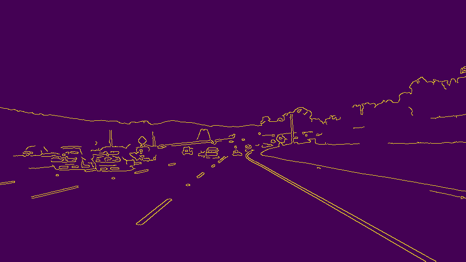
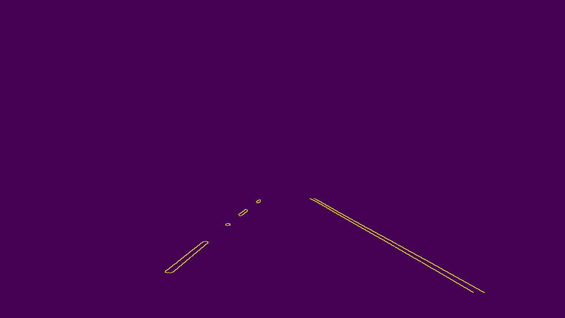
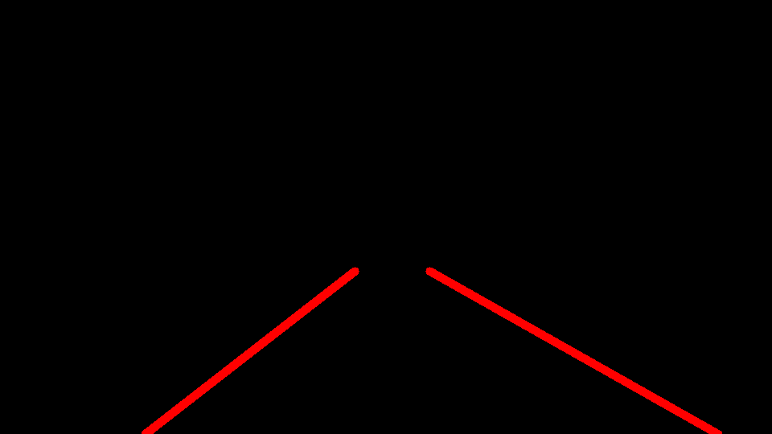
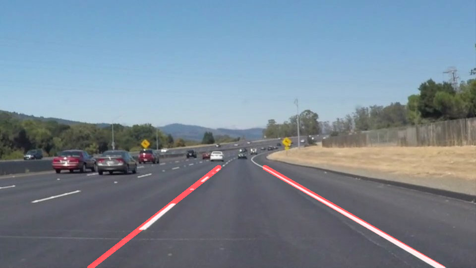
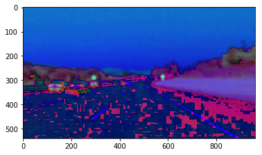

# **Finding Lane Lines on the Road** 

## Writeup

---

**Finding Lane Lines on the Road**

The goals / steps of this project are the following:
* A pipeline that finds lane lines on the road

[//]: # (Image References)

---

### Reflection

### 1. Pipeline and The draw_lines() Function.

My pipeline consisted of 6 steps:
1. Convert image to gray color

2. Blur image using Gaussian Blur, to reduce non-significant color changes

3. Apply Canny filter based on contrast color change

4. Masked some region of images

5. Draw lines on detected lanes, extrapolate it to upper and lower boundaries

6. Render the detected lane lines to initial image, and return it

In order to draw a single line on the left and right lanes, I modified the draw_lines() function by:
* determine the center of screen to separate potential left lane line, and right lane lines
* calculate the slope of each line, add it to list of left slopes or to the list of right slopes, while excluding extreme slopes
* determine the upper coordinate, and lower coordinate for line extrapolation
* render the left lane line, and right lane line

### 2. Shortcomings of Current Pipeline

Obvious shortcomings would happen when it encounter junction where the lane is not straight. Existing code makes assumption the lane that appears in camera is always  looking straight.

Another shortcoming is when another car with similar color to lane color (white/yellow), or similar color to road, shows up in camera. It will confuse the software.

Another shortcoming is hard-coded assumption of the center of the lane, is the center of image. I don't have time to create non-centered lanes images/videos, to test the software.

### 3. Possible Improvements

A possible improvement is to use different color pallete, that are processed separately in paralell. Then combined later to make final recommendation.

The center of lane should be determined dynamically, instead of using hard coded ratio/value.

I haven't solve the most difficult part of the challenge, to be able to detect yellow color in light gray road. I am learning to use different color pallete and another approach using opencv API to filter certain colors (yellow, white, etc).

